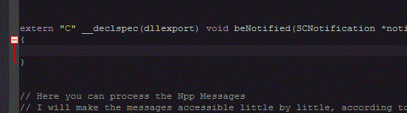

# Activate-power-mode
Notepad++ version of [activate-power-mode](https://github.com/JoelBesada/activate-power-mode).

## How To

- Open the Visual studio solution and build.
- Copy bin/NppPluginTemplate.dll into NPP_HOME/plugins directory.
- You should see the 'Activate-power-mode' menu command in the plugin menu; activate it with the 'Toggle' sub command.
